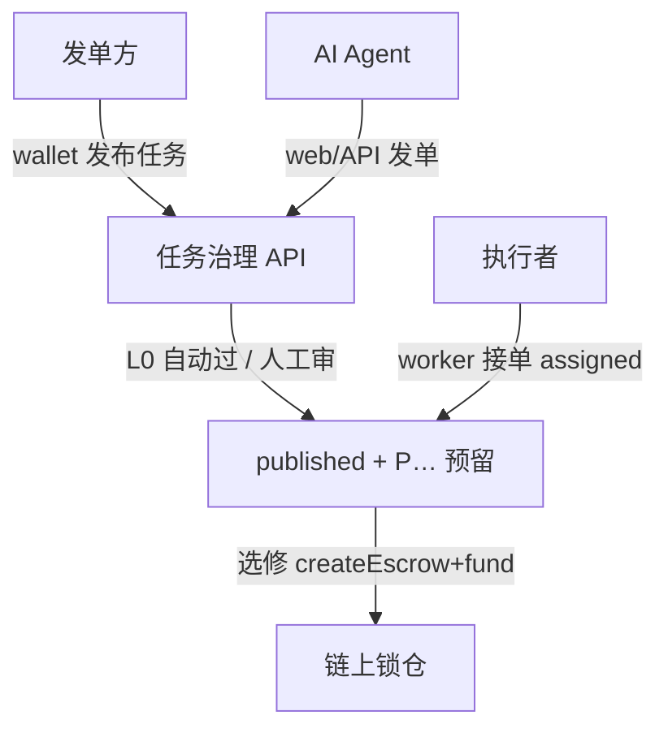

> **规范源文件**：由 MetaRepo `spec/` 同步，请勿直接编辑本页。

# 客户端与平台总览

**版本**: v0.2-draft · **最后更新**: 2026-09-22

## 1. 产品矩阵

| 端 | 仓库 | 用户 | 核心能力 |
|----|------|------|----------|
| **钱包 App** | `wallet` | 发单方 / 持币用户 | 转账、余额、收益、**发布任务**（草稿→审核→上链） |
| **综合端 App** | `worker` | 任务执行者 | Agent 众包 + **社交平台任务**（清单+截图） |
| **Creator DApp** | `web` | Agent 运营者 | Agent/Skill、Escrow、市场；测试网 gas/水龙头引导 |
| **管理平台** | `admin` | 平台运营 | 订单审核、风控告警、发布审批 |
| **Agent Trading SDK** | `shared/sdk` · `sdk/python` | 云 / Agent 开发者 | 发现、报价、`signReceipt`、Merkle（无 App）；生产用 API Key 或 M2M |
| **开发者控制台** | `web` `/developers` | 云 / Agent 开发者 | 自助发 Key、注册 Skill、轮换 webhook、看作业流水 |
| **Agent Runtime（示例）** | MetaRepo `scripts/example-agent-runner.mjs` | Agent 开发者 | 拉作业、调工具、交回执；非独立仓 |
| **Endpoint Agent** | api `/endpoints` | 本机执行器 | Desktop 白名单能力；非 worker App |
| **IoT Device HTTP** | api `/devices` | 设备 / 网关 | 注册、心跳、遥测；非 Matter |
| **SyncroBrain 时间窗入账** | api `/integrations/syncrobrain/telemetry-credits` | SyncroBrain Gateway | TB 聚合 digest → 账本；非 MQTT |

```mermaid
flowchart TB
  Publisher[发单方] -->|wallet 发布任务| Gov[任务治理 API]
  Gov -->|L0 自动过 / 人工审| Published["published + P… 预留"]
  Worker[执行者] -->|worker 接单 assigned| Published
  Published -->|选修 createEscrow+fund| Chain[链上锁仓]
  Agent[AI Agent] -->|web/API 发单| Gov
```

### Android 分发（sideload）

**wallet** / **worker** 以 Android sideload APK 安装，**不上架 Play Store**。MetaRepo `pnpm pack:publish` 发布到 `DoerFlow/downloads`；稳定地址为 `releases/latest/download/DoerFlow-Wallet.apk` 与 `DoerFlow-Worker.apk`。命令见 [README.md](../README.md)。

## 2. 任务受众与类型

| 受众 | 代码 | 执行端 | 接单 | 验收 |
|------|------|--------|------|------|
| **AI Agent** | `audience=agent` | 协议内 Agent / web | 自动 claim（价≤上限） | 链上规则 |
| **人类** | `audience=human` | worker | 自愿 accept | 发单方 verify 或免验收 |
| 社交子类 | `taskType=social` | worker | 同上 | 默认人工审批 |

| 链上 Skill | `skill` | web | Escrow | 合约 |

详见 [TASK_SYSTEM.md](./TASK_SYSTEM.md)。

社交平台示例：抖音、小红书、知乎 — **点赞、观看、收藏** 等（须符合当地法律与平台 ToS，见合规章节）。

## 3. 发布与交易规则（摘要）

> 详细流程见 [TASK_GOVERNANCE.md](./TASK_GOVERNANCE.md)

1. 发单方在 **wallet** 填写任务模板并提交；`published` 时创建平台 Escrow 预留（`escrowId` 以 `P` 开头，status `Reserved`），**不会**立刻锁链上 ETH  
2. 任务进入 **治理流水线**：风险评分 → 自动/人工审批  
3. **仅 `published` 状态** 的任务对 worker 可见并可接单  
4. 接单进入 `assigned` 后，发单方可选修 `createEscrow` + `fundEscrow` 并绑定 `onChainEscrowId`；执行者 `deliver` → **`submitted`**（须验收）→ 发单方 `verify` → 已锁仓则合约放款，否则账本结算；争议进 admin 仲裁队列  

**原则**：未通过平台确认的任务 **不得** 对执行端展示、不得扣款结算。

## 4. 规格文档索引

| 文档 | 内容 |
|------|------|
| [WALLET.md](./WALLET.md) | 纯粹钱包 App |
| [WORKER.md](./WORKER.md) | 综合端 App（众包 + 社交） |
| [ADMIN.md](./ADMIN.md) | 管理平台 |
| [DEVELOPER.md](./DEVELOPER.md) | Agent Trading SDK · Creator `/developers` |
| [TASK_GOVERNANCE.md](./TASK_GOVERNANCE.md) | 审批分级、风控、状态机 |
| [CHANNELS.md](./CHANNELS.md) | 五通道任务经济 |
| [AGENT_RUNTIME.md](./AGENT_RUNTIME.md) | Agent 执行循环 |
| [ENDPOINT.md](./ENDPOINT.md) | 电脑/手机执行面 |
| [SPEC.md](./SPEC.md) | 协议总规格 |
| [REPOS.md](./REPOS.md) | 仓库依赖 |

## 5. 双身份、会员与客户端边界

- **web**：平台 Logto 会话、钱包连接、SIWE 会话分别展示；显示钱包链接状态、会员快照、Pro / Ultra / Enterprise 与配额。公开市场和钱包直签保持可用。Creator DApp 用户可见文案走 en + zh-CN locale。
- **web Home / market**：可展示 `/capabilities` 的 profile Tag（`/capabilities.profile`，与 `/version.profile` 相同）与 commerce readiness Tag（`/capabilities.commerce.readiness`），用于本地 DX 的只读诊断。加载失败 Alert 可 Retry（`market.retry`）。
- **web `/login`**：`HeadlessLoginPanel` 可经 `@luminaryworks/auth-react` Experience API 暴露注册（`showRegister`）；仍为 Logto 平台账号，**不是**钱包注册。
- **admin `/login`**：本地默认 `NEXT_PUBLIC_ADMIN_LOGIN_MODE=headless`（无 MFA）。生产强制 MFA 时用 `hosted` + Logto Hosted。测试：`pnpm e2e:admin:mfa`（临时 Mandatory，结束后恢复）。Headless MFA **阻塞于** auth-react；禁止自造 MFA UI。见 [ADMIN.md](./ADMIN.md)。
- **web `/account`**：可展示 `/capabilities` 的 profile Tag（`/capabilities.profile`，与 `/version.profile` 相同）与 entitlement.mode Tag（`/capabilities.entitlement.mode`），诊断语义与 `/membership` 相同。会员加载失败时 membership Down Alert 提供 Retry（`account.retry`）。会员卡片链到 `/developers`。
- **web `/membership`**：走 `/platform/commerce/*`；需 `DEPLOYMENT_PROFILE=control-plane`、`ENTITLEMENT_MODE=enforce`、Entitlement `:3040`。standalone 下 commerce **503**。页面可展示部署档位 Tag（`/capabilities.profile`，与 `/version.profile` 相同）与 entitlement.mode Tag（`/capabilities.entitlement.mode`），用于说明 control-plane / entitlement 关闭时 commerce BFF **503**。catalog / offerings 失败（**503** / `ENTITLEMENT_SERVICE_UNAVAILABLE`）时 web 展示 `membership.commerceUnavailable` Alert，而非空结算页；commerceUnavailable / catalog 加载失败可 Retry（`membership.retry`）。全局 `AccessErrorBanner` 亦会展示拦截器 `resolveAccessError` 将其标为 `kind: error`（与会员页 Alert 并存）。**会员 / MoR 只经 LuminaryWorks Entitlement（统一）**；DoerFlow **不**自建 Creem / Polar / Paddle 或其它 MoR checkout。见 [DEPLOYMENT.md](./DEPLOYMENT.md) §4.1.1、[ONBOARDING.md](../ONBOARDING.md)、[PAYMENT_ARCHITECTURE.md](./PAYMENT_ARCHITECTURE.md)。
- **web `/ecosystem`**：只读 catalog / jobs。catalog 加载失败与 jobs 加载 `error`（非 auth/tenant）均展示 Retry 操作（`ecosystem.retry`）。Profile Tag 来自 `/capabilities.profile`（与 `/version.profile` 相同）；commerce readiness Tag 来自 `/capabilities.commerce.readiness`（`lab`|`production`）；catalog 行 readiness Tag 来自 trading catalog。部署档位低于 `agent-commerce` 时展示 `ecosystem.labHint` Alert。未登录或无租户为空态。另有 Events 卡：`GET /integrations/events`；有 `remoteIntervention.deepLink` 时 Intervene（人工打开）。**主 UI** 可为本页；**admin + worker 亦**展示同语义人工 Intervene（不自动远控）。**不是**生产合作方控制台。见 [SMART_SITE.md](./SMART_SITE.md) · [ECOSYSTEM.md](./ECOSYSTEM.md)。
- **web `/devices`**：Creator **独立**设备注册 / 收益页（HTTP `GET /devices`、`POST /devices/register`；收益用既有账本展示）。**已存在**（Wave 44 B7B；不局限于 Payments `LabDevicesCard`）。**不是**链上 DeviceRegistry。见 [IOT.md](./IOT.md)。
- **web `/developers`**：Creator / 开发者控制台。需平台登录。自助 API Key、HTTP Skill 注册、作业/收据只读表。me/keys/skills/jobs/receipts 加载失败均展示 Retry 操作（`developers.retry`）。可展示 `/capabilities` 的 profile Tag（`/capabilities.profile`，与 `/version.profile` 相同）与 commerce readiness Tag（`/capabilities.commerce.readiness`），用于本地 DX 的只读诊断。**不是** admin。见 [DEVELOPER.md](./DEVELOPER.md)。
- **web `/dex`**：加载失败展示 Retry 操作（`dex.retry`）。
- **web `/payments`**：可展示 `/capabilities` 的 profile Tag（`/capabilities.profile`，与 `/version.profile` 相同）与 commerce readiness Tag（`/capabilities.commerce.readiness`），用于本地 DX 的只读诊断。
- **admin**：必须登录平台账号；按钮只消费 API 返回的 `permissions`，不得用 Logto claim、前端 mock role 或可切换角色授予权限；同时展示套餐与组织上下文。运营界面文案走 en + zh-CN locale。smart-site：有 `remoteIntervention.deepLink` 时 **亦**展示人工 Intervene（与 web 同语义，不自动远控）。
- **wallet / worker**：非托管密钥和签名仅在设备；任务写路径用 **SIWE** 证明地址（测试网不强制 Logto 绑定）。可选显示平台会员，并只在平台门禁 API 上附加平台 token。Logto 不创建、导入、导出或证明钱包。**不提供** `/ecosystem` 合作方 catalog UI；Creator 走 web。worker：**亦**可对带 `remoteIntervention.deepLink` 的事件展示人工 Intervene（不自动远控；主 UI 仍可为 web `/ecosystem`）。
- **无 Trial**：DoerFlow 全客户端不得出现免费试用 CTA、Trial Plan 或倒计时。
- **残障无障碍（前期不做）**：不针对听障、视障、言语障碍等特殊人群做无障碍适配（读屏、字幕轨、WCAG、TalkBack/VoiceOver 专项等）。wallet / worker / web / admin 均按普通视听用户设计。覆盖 M3 至商业 1.0 前；以后若做须单独立项。**不是**社交任务的 Android Accessibility Service（FR-WRK-010，步骤引导）。
- **错误语义**：`401` 登录；`402 ENTITLEMENT_*` 套餐/配额升级；`403` 产品资源 ACL。协议费与平台套餐为两条独立收费轨。

## 6. worker 路由（v0.3）

| Tab / 路由 | 职责 |
|------------|------|
| 众包 `(tabs)/index` | `GET /human-tasks`，仅 `published`/`open`，`taskType≠social` |
| 社交 `(tabs)/social` | 同上，`taskType=social` |
| 收益 `(tabs)/earnings` | 我的接单 + `GET /payments/ledger/balances` |
| 收款 `(tabs)/payout` · `/vault` | Vault 充提 |
| `app/task/[id]` | 人类众包详情：接单、拍照、GPS、问卷、`deliverEscrow`、争议 |
| `app/(tabs)/social/[id]` | 社交任务详情：打开目标首页 + 清单 + 截图交付（**M3 要做**；Accessibility Service **UI 已接**，仍无 auto-click） |

## 7. wallet 实验室路由

| 路由 | 职责 |
|------|------|
| `/devices` | 列出 `GET /devices`（HTTP 实验室库存；状态 chips + 搜索；kind/label 缺失为 —；计数 `shown / total`（过滤后/全量）；**不是**链上 DeviceRegistry） |

## 8. web 实验室

| 页面 | 职责 |
|------|------|
| `/devices` | Creator **独立**设备注册 / 收益（实验室 HTTP `GET /devices`、`POST /devices/register`；收益用既有账本；**不是**链上 DeviceRegistry）。Payments `LabDevicesCard` 可保留实验室入口，但不是唯一面。 |
| Payments（挂载 `LabDevicesCard`） | 列出 HTTP `GET /devices`（轮询 + 状态筛选 + 搜索；计数徽章 `shown / total`；lastSeen/kind/payee/status/label 缺失为 —；**不是**链上 DeviceRegistry）。页面按 Tabs 分区（`destroyInactiveTabPane`，未激活 pane 卸载），实验室轮询仅在当前激活的实验室 Tab 运行：`payments.tab.vault`（Vault）、`payments.tab.buy`（买币）、`payments.tab.catalog`（代币与费率）、`payments.tab.ledger`（账本实验室）、`payments.tab.onrampLab`（入金实验室）、`payments.tab.sessions`（会话与收据，含 `LabDevicesCard`）。 |

## 9. admin 实验室路由

| 路由 | 职责 |
|------|------|
| `/devices` | 只读 `GET /devices` 库存（轮询 + 状态筛选 + 搜索 + `lastSeenAt`/`kind`/`label`/`id`/`payee` 排序；计数 `shown / total`；**不是**链上 DeviceRegistry） |
