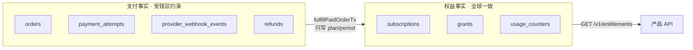
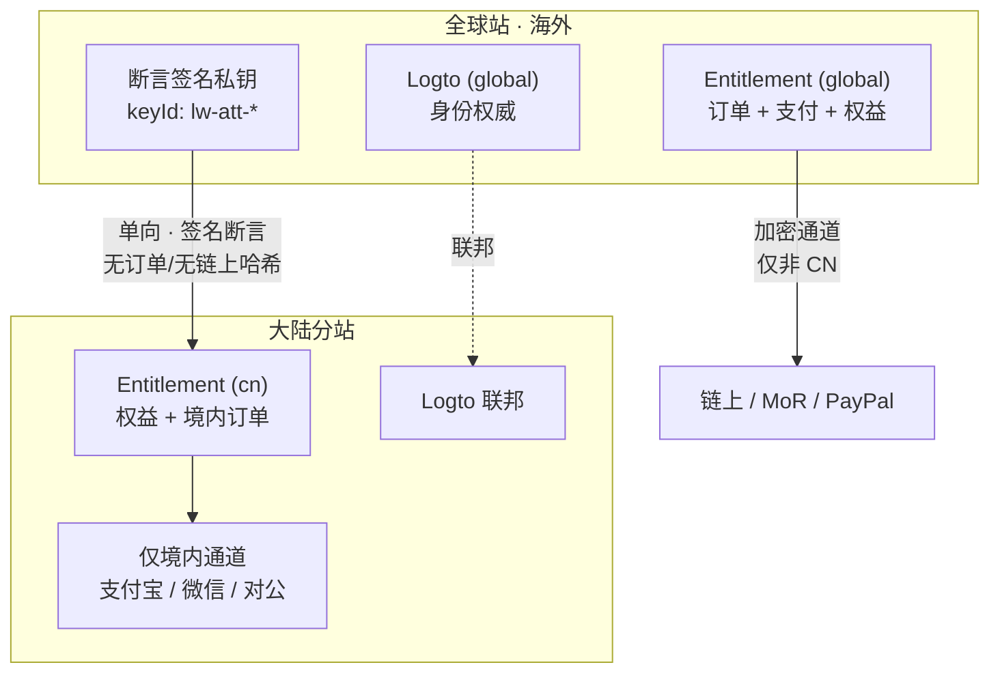

> **规范源文件**：由 MetaRepo `spec/` 同步，请勿直接编辑本页。

# 跨区权益可携带性（Geo Portability）

> **状态**：Accepted（设计冻结）· **实现**：未落地，P4 · **决策日**：2026-09-16
> **关联**：[PAYMENT_ARCHITECTURE.md](./PAYMENT_ARCHITECTURE.md) · [LuminaryWorks payment-platform.md](https://github.com/LuminaryWorks/LuminaryWorks/blob/main/spec/payment-platform.md) §8 · [LuminaryWorks subscription-and-entitlement.md](https://github.com/LuminaryWorks/LuminaryWorks/blob/main/spec/subscription-and-entitlement.md)

回答一个具体问题：**用户在海外用区块链买的会员，在中国大陆分站还能不能用？怎么做？**

结论：**能用**，而且不需要新机制——因为权益与支付轨在现有设计里已经解耦。真正需要新建的是**跨区权益同步**，而不是跨区支付。

## 0. 决策摘要

| # | 决策 |
|---|------|
| D-GEO-01 | **「能在哪付钱」与「权益在哪有效」彻底解耦。** 前者按司法辖区闸门，后者全球一致 |
| D-GEO-02 | `subscriptions` / `grants` **不含支付轨、链上哈希、钱包地址**。它们确实带 `source` + `sourceRef`（`source="order"` 时 `sourceRef` 即 `orders.id`），但那是不透明内部 ID，**投影为断言时必须剥离** |
| D-GEO-03 | 大陆分站有**独立 Entitlement 库**（数据驻留 + PIPL），不跨境调用全球 Entitlement |
| D-GEO-04 | 跨区同步只传**单向 Ed25519 签名权益断言**，复用已有 License 机制。订单、支付凭证、链上哈希**一律不出境、不入境** |
| D-GEO-05 | 大陆站**不展示、不售卖**任何加密通道。海外买的会员大陆可用，但**在大陆续费**必须走大陆合法通道 |
| D-GEO-06 | 身份以全球 Logto `sub` 为锚，大陆站联邦接入。断言以 `sub` 为主体键 |

## 1. 为什么"已经能用"

关键在于现有数据模型的一个属性：**支付事实与权益事实是分离的两组表**。



履约事务 `fulfillPaidOrderTx`（`modules/orders/order-fulfillment.ts`）从支付侧写入权益侧时，只搬运 plan、features、quotas、period，外加一个来源标记 `source` + `sourceRef`。

**准确说明**（不要把这条说得比事实更强）：

| 字段 | 权益表里有吗 | 合规影响 |
|------|--------------|----------|
| `plan` · `features` · `quotas` · `startsAt` · `endsAt` | 有 | 无。这就是要同步的内容 |
| `source`（`order` / `trial` / `license` / `partner` / `promotion`） | **有** | 低。只是来源分类，不含渠道身份 |
| `sourceRef`（`source="order"` 时 = `orders.id`） | **有** | **中**。是订单引用，尽管是不透明 UUID。投影为断言时**必须剥离** |
| `providerId` · `txHash` · `walletAddress` · 金额 · 币种 | **无** | 这些只在 `orders` / `payment_attempts` 侧 |

所以大陆站读取权益时，读到的是"此人在 2026-09-16 至 2027-09-16 期间是 Pro"，**读不到也不需要知道这是用 USDT 买的**——真正的加密支付痕迹（渠道、链上哈希、钱包地址）全在支付侧表里，不在权益侧。这不是权宜之计，是当前架构的自然结果；需要新做的只是断言投影时把 `source` / `sourceRef` 去掉。

## 2. 需要新建的：跨区权益断言

### 2.1 为什么不能直接跨境调用

三个被否决的方案：

| 方案 | 否决理由 |
|------|----------|
| 大陆站跨境调全球 Entitlement | 跨境个人信息传输触发 PIPL 出境评估；且跨境延迟进入每次鉴权热路径 |
| 双向同步 `orders` / `payment_attempts` | 把加密支付凭证同步进境内库，主动制造合规问题 |
| 大陆站各自独立售卖、互不承认 | 用户在海外买的会员在大陆失效，体验不可接受 |

### 2.2 采用：单向签名断言

全球站签发 Ed25519 签名的**权益断言**，大陆站本地验签后生效。**复用已有实现**——`services/entitlement/src/license/ed25519.ts` + `canonical-json.ts` 已经在做离线 License 的同一件事，断言是它的一个新用途，不是新密码学。

断言载荷（规范化 JSON 后签名）：

```json
{
  "v": 1,
  "kind": "entitlement_attestation",
  "subject": "logto_sub_xxx",
  "productCode": "dataluminary",
  "plan": "pro",
  "features": [{ "code": "ai.analysis", "type": "bool", "value": true }],
  "quotas": [{ "code": "dashboard.count", "limit": 50, "mode": "gauge" }],
  "validFrom": "2026-09-16T00:00:00Z",
  "validUntil": "2027-09-16T00:00:00Z",
  "issuedAt": "2026-09-16T12:00:00Z",
  "issuerRegion": "global",
  "keyId": "lw-att-2026-09"
}
```

**禁止出现的字段**：`orderId`、`source`、`sourceRef`、`providerId`、`txHash`、`walletAddress`、`amountPaid`、`currency`，以及任何支付凭证或链上标识。这条是硬约束，不是建议——断言 schema 校验采用**严格模式**，遇到未知字段直接拒绝而非忽略，防止将来有人顺手加上 `txHash`。

实现见 `services/entitlement/src/license/attestation.ts`：`ATTESTATION_FORBIDDEN_FIELDS` + `ATTESTATION_ALLOWED_FIELDS` 双向白名单，`validateAttestationShape()` 在**验签之前**执行。

### 2.3 规则

| 规则 | 说明 |
|------|------|
| 单向 | 只有 `global → cn`。大陆站不向全球站回传权益 |
| 短有效期 + 续签 | 断言 `validUntil` 不超过订阅期末，且单张断言 TTL 建议 ≤ 7 天，由全球站周期续签。避免退款后境内长期生效 |
| 撤销 | 退款 / 降级时全球站停止续签，并下发 `revocations` 列表（仅含 `subject` + `productCode` + `revokedAt`） |
| 主体键 | 全球 Logto `sub`。大陆站联邦接入同一身份，不另建用户体系 |
| 配额独立计数 | `usage_counters` **不跨区合并**。断言只传 `limit`，境内用量境内计。同一账号在两区各自享有配额上限 |
| 验签失败 | fail-closed，视为无权益（402），不降级为"暂时放行" |
| 时钟 | 断言校验允许 ±5 分钟偏移；超出按无效处理 |

### 2.4 配额不跨区合并的取舍

这是一个**明确的商业让步**：同一个 Pro 用户在海外站和大陆站各自拥有一份配额，总量翻倍。

选择这样做的原因是替代方案更差——跨区实时合并用量需要把用量流跨境同步，既是 PIPL 出境问题，又把跨境网络放进每次 `consume` 的热路径。对于 `gauge` 型配额（仪表盘数、设备数）这个让步影响很小，因为资源本身是分区创建的。若某个 `counter` 型配额（如 AI token）成本敏感，应通过**降低单区上限**解决，而不是引入跨境用量同步。

## 3. 付款侧的辖区闸门

沿用 LuminaryWorks `payment-platform.md` §8 已有机制（可信代理 header → GeoIP → 丢弃客户端自报），本文只定义大陆站的通道集：

| 市场 | 可展示通道 |
|------|------------|
| `CN` | `alipay_f2f` · `wechat_pay_v3`（有商户号后）· `manual` · `contract` |
| `CN` 明确禁止 | `doerflow_credit` · `coinbase_commerce` · `okx_onchain` · `bitpay` · `creem`（MoR 无境内收单资质） |
| `GLOBAL` | 全部 *operationally enabled* 的通道 |

加密通道保持**双重检查**：IP **或** billing country 任一为 CN 即拒绝，两者都非 CN 才允许。

### 3.1 续费的辖区切换

一个海外用 USDT 买了 Pro 的用户，到期时身在大陆：

1. 权益在到期前**照常有效**（断言仍在续签）；
2. 续费入口展示的是**大陆通道**（支付宝 / 微信），不展示 `doerflow_credit`；
3. 若用户希望仍用链上余额续费，必须在非 CN 辖区完成下单（IP 与 billing country 双非 CN）。这是闸门的预期行为，不是 bug。

用户可见文案必须解释"为什么这里看不到加密支付"，避免被理解为故障。文案入 locale JSON（`en` + `zh`），不得硬编码。

## 4. 部署拓扑（目标态）



大陆站**自己也能卖**（境内通道下单 → 境内 `orders` → 境内 `subscriptions`）。断言机制只负责把**境外购买**的权益带进来，两者在境内库中并存，取并集（`effectivePlan` 取 rank 较高者，与现有 `resolution.ts` 的 union 语义一致）。

## 5. 明确不做

- 不做跨境资金划转、不做境内外账户互转。
- 不在境内库存储任何链上地址、tx hash、加密支付凭证。
- 不把 IP 当作 KYC、制裁筛查或加密支付合规的充分证明（IP 只控 UI 与通道路由）。
- 不做双向权益同步。
- 不做跨区用量合并（见 §2.4）。

## 6. 需求追溯

| 需求 ID | 描述 | 仓库 / 模块 | 阶段 |
|---------|------|-------------|------|
| FR-GEO-001 | 权益表不含渠道 / 链上 / 钱包 / 金额标识（`source`·`sourceRef` 例外，断言投影时剥离） | LuminaryWorks entitlement | **已满足**，守卫测试已加 |
| FR-GEO-002 | Ed25519 权益断言签发 / 验签 / 续签 / 撤销 | LuminaryWorks entitlement | **P4** |
| FR-GEO-003 | 断言 schema 严格模式，拒绝支付类字段 | LuminaryWorks entitlement | **P4** |
| FR-GEO-004 | 大陆站通道集与续费辖区切换文案 | LuminaryWorks entitlement, 各产品 web | **P4** |
| FR-GEO-005 | 大陆独立 Entitlement 库与 Logto 联邦 | deploy | **P4** |

## 7. 现在就已落地的部分

整体同步服务在 P4，但两件事现在就做了，因为它们定义的是**不可回退的不变量**：

1. **断言契约与严格校验**（`license/attestation.ts`）：类型、双向字段白名单、验签前形状校验、时钟偏移、TTL 上限。签发 / 续签 / 撤销服务留待 P4。
2. **FR-GEO-001 守卫测试**（`test/geo-portability.spec.ts`）：断言 `subscriptions` / `grants` 的列集合中不存在渠道 / 链上 / 钱包 / 金额字段。

第 2 条的理由：这条性质当前是**偶然成立**的。将来任何人为了方便对账，在 `subscriptions` 上加一个 `providerId` 或 `txHash` 列，就会静默摧毁跨区可携带性，而且要到建大陆站时才会发现。用一个测试把它钉死，成本几行代码。
