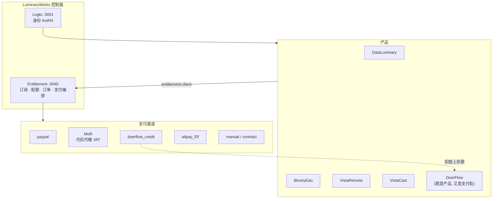
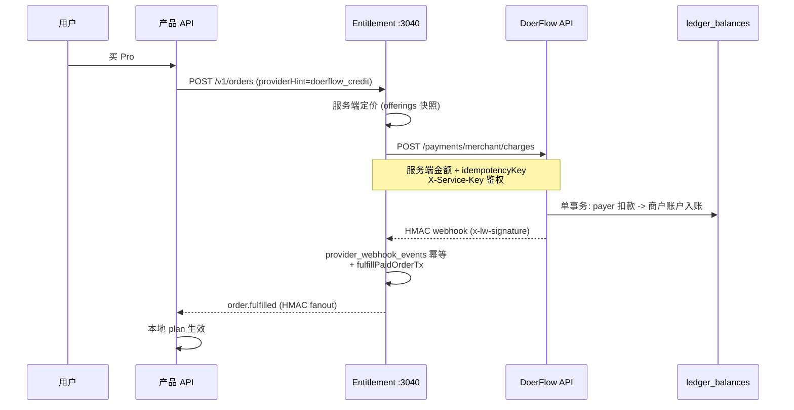

> **规范源文件**：由 MetaRepo `spec/` 同步，请勿直接编辑本页。

# 跨产品支付与会员架构（Payment Architecture）

> **状态**：Accepted · **决策日**：2026-09-16 · **修订**：2026-09-18（D-PA-09：MoR 仅 Entitlement，DoerFlow 不自建 Creem/Polar/Paddle） · **范围**：LuminaryWorks 六产品会员收款 + DoerFlow 作为支付轨
> **关联**：[LuminaryWorks payment-platform.md](https://github.com/LuminaryWorks/LuminaryWorks/blob/main/spec/payment-platform.md) · [ASYNC_PAYMENTS.md](./ASYNC_PAYMENTS.md) · [ONRAMP.md](./ONRAMP.md) · [GEO_PORTABILITY.md](./GEO_PORTABILITY.md) · [COMMERCIAL.md](./COMMERCIAL.md)

本文是 **DoerFlow 与 LuminaryWorks 会员/支付融合** 的唯一权威。它不重新定义支付编排（那是 LuminaryWorks `payment-platform.md` 的职责），只定义三件事：

1. 个人（无公司主体）阶段可用的**活体收款通道**；
2. DoerFlow 如何作为一条**支付轨**给 LuminaryWorks 产品收款；
3. 支付能力如何在**私有化交付**时整体摘除。

## 0. 决策摘要

| # | 决策 |
|---|------|
| D-PA-01 | 会员真相源**只有** LuminaryWorks Entitlement（`:3040`）。DoerFlow 不自建会员表，只作支付轨与消费方 |
| D-PA-02 | 新增通道一律实现已有 `PaymentAdapter` 接口 + 一行 `payment_provider_configs`，**不新增支付子系统** |
| D-PA-03 | 个人阶段三条通道并行：`paypal`（已实现）、MoR（**仅 LuminaryWorks Entitlement**）、`doerflow_credit`（新增）。需 KYB 的 `coinbase_commerce` / `bitpay` / `wechat_pay_v3` / `unionpay_quickpass` 保持 disabled |
| D-PA-04 | `doerflow_credit` 的金额**只由 Entitlement 服务端定价**；DoerFlow 永不信任调用方金额 |
| D-PA-05 | 链上余额**按币种分账**（`ledger_balances` 主键 `(account, asset)`）。不混池、不承诺跨币种赎回、不发行可赎回美元债权 |
| D-PA-06 | 不做法币提现。出金 = 提到用户自托管钱包；平台不持有法币、不做货币转移 |
| D-PA-07 | `PAYMENTS_ENABLED=false` 时 `PaymentsModule` 整体不注册、公开 webhook 路由不挂载。私有交付包不含 PSP 面 |
| D-PA-08 | 付款方区分 `individual` / `business`；企业走 `manual`（对公转账）+ `contract`（合同 PO） |
| D-PA-09 | **2026-09-18**：会员 MoR **只经 LuminaryWorks Entitlement**（统一）。DoerFlow **不**自建 Creem / Polar / Paddle 适配器或 checkout |

## 1. 权威边界



**不变量**：

- 产品永不自建会员表，只经 `@luminaryworks/entitlement-client` 调 `GET /v1/entitlements`、`POST /v1/entitlements/check|consume`。
- 商业字段（plan / quota / feature）**永不进 JWT**。权益不足 fail-closed 返回 **402**，与 Casbin 资源拒绝的 403 区分。
- DoerFlow 的协议费、Job 单价、Escrow、Gas **不进 Entitlement**（已冻结，见 `payment-platform.md` §1）。

## 2. 三条个人可用通道

### 2.1 通道对比

资质门槛从低到高：

| 通道 | `ProviderId` | 主体要求 | 税务 | 状态 |
|------|--------------|----------|------|------|
| DoerFlow 链上余额 | `doerflow_credit` | **无**（自托管地址收款，无 KYB） | 自行申报 | 新增适配器 |
| PayPal | `paypal` | 个人或 Business 账号，个人可开 | 自行申报 | **已实现，零新代码** |
| Merchant of Record | `creem` | 个人 / 自然人可开户（需实际验证） | **MoR 代扣代缴 VAT / 销售税** | 新增适配器 |
| 支付宝当面付 | `alipay_f2f` | 营业执照 | 自行申报 | 已实现，待主体 |
| 微信 v3 / 银联 | `wechat_pay_v3` / `unionpay_quickpass` | 营业执照 + 入网 | 自行申报 | 已实现，待主体 |
| Stripe Checkout | `stripe_checkout` | 受支持国家的经营主体 | 自行申报 | 已实现，待主体 |
| Coinbase / BitPay | `coinbase_commerce` / `bitpay` | 企业 KYB | 自行申报 | 已实现，待主体 |
| 人工 / 合同 | `manual` / `contract` | 无 | 线下开票 | 已实现 |

### 2.2 Merchant of Record（MoR）

MoR 供应商作为**记录商户**（seller of record）：它对终端买家开票、代扣代缴 VAT / 销售税，再按周期把净额打到个人银行 / Wise / Payoneer。这是无公司主体合法销售 SaaS 的标准解法，也是后续交付给客户时"客户有更多选择"的基础。

候选：Creem · Polar · Paddle · Lemon Squeezy（**开户与适配器在 LuminaryWorks Entitlement，不在 DoerFlow**）。**开户资质必须实际验证**——不同供应商对自然人开户的接受度不同，不得假定。

适配器按**单 vendor** 实现（webhook 签名校验必须 vendor-specific，不可抽象成通用 MoR 适配器），其余供应商留 `ProviderId` 槽位。

MoR 与直连 PSP 的语义差异，适配器必须正确映射：

| 差异点 | 处理 |
|--------|------|
| 买家看到的商户名是 MoR，不是 LuminaryWorks | 结算页与条款须披露 |
| 金额含税，MoR 回传 gross / tax / net 三个值 | 订单快照比对用 **gross**；`net` 仅入对账，不作履约判据 |
| 退款可能由 MoR 侧发起（买家直接找 MoR） | webhook 必须处理非本平台发起的 refund 事件，级联撤销 grant |
| 结算周期 T+N，非即时到账 | 履约以 webhook `succeeded` 为准，**不等打款** |

### 2.3 DoerFlow 链上通道（`doerflow_credit`）

用 DoerFlow 的链上 USDT / USDC 余额支付 LuminaryWorks 会员。同时满足两个需求：个人无资质收款，以及"LuminaryWorks 产品可通过 DoerFlow 付费"。

详见 §3。

## 3. DoerFlow 作为支付轨（FR-PAY-020）

### 3.1 时序



### 3.2 资金不变量（money-critical）

这一段是本架构里唯一可能导致**真实资金损失**的地方，约束不得放宽：

| 不变量 | 实现要求 |
|--------|----------|
| **服务端定价** | DoerFlow 只接受 Entitlement 传来的 `amountMinor` + `currency` + `asset`，并与 `orderId` 绑定。DoerFlow 不查目录、不算价、不信任客户端 |
| **扣款原子性** | payer 扣减与商户账户入账必须在**同一个 Postgres 事务**内，对 `ledger_balances` 的 `(account, asset)` 行加锁。禁止先扣后记 |
| **余额不得为负** | 扣款前 `SELECT ... FOR UPDATE` 校验 `amount >= charge`，不足则返回稳定错 `LEDGER_INSUFFICIENT_FUNDS`，**不部分扣款** |
| **DoerFlow 侧幂等** | `ledger_operations` 以 `operationId` 为主键。重放同 key 返回**首次结果**，不二次扣款 |
| **幂等必须用 `ON CONFLICT DO NOTHING`** | **禁止** 用 try/catch 捕获唯一键冲突：PostgreSQL 中语句失败会让**整个事务进入 aborted 状态**（`current transaction is aborted`），后续读取首次结果的查询必然失败，调用方拿到 500 而不是首次结果 —— 结果是**钱已扣、会员没开**。必须 `INSERT … ON CONFLICT DO NOTHING RETURNING`，按返回行数判断是否为重放 |
| **Entitlement 侧幂等** | `provider_webhook_events` 以 `(provider, configId, eventId)` 唯一。重复事件返回 200 且不重复履约 |
| **两侧幂等键必须可关联** | `eventId` 由 `idempotencyKey` 确定性派生，使对账能把一次扣款与一次履约一一对上 |
| **失败方向安全** | 扣款成功但 webhook 投递失败 → 由 durable outbox 重投（复用 `outbox_callbacks` 模式）。**绝不**先履约后扣款 |
| **金额校验** | Entitlement 收到 webhook 后仍须比对订单快照的金额 / 币种 / 商户，不符返回 `PAYMENT_AMOUNT_MISMATCH`（409） |
| **退款** | 反向账本操作，同样走 `idempotencyKey`；链上已提走的余额不可强制回收，退款只在账本内可用余额范围内执行 |

### 3.3 接口契约

DoerFlow 侧新增（服务间调用，非公开）：

```text
POST /payments/merchant/charges
  鉴权：X-Service-Key（服务间），不接受用户 Bearer
  入参：{ orderId, subjectId, asset, amountMinor, currency, idempotencyKey, metadata? }
  出参：{ chargeId, status: 'succeeded'|'failed'|'insufficient_funds', ledgerOpId, eventId }
```

Entitlement 侧复用已冻结的公开回调路径：

```text
POST /v1/payments/webhooks/doerflow_credit/:configId
  签名：x-lw-signature: v1=<base64url(HMAC-SHA256(secret, `${timestamp}.${nonce}.${rawBody}`))>
```

签名方案**复用已有的 partner callback 方案**（见 LuminaryWorks `services/entitlement/src/modules/partner/`），不新造签名格式。验签必须对**原始字节**，禁止先 `JSON.parse` 再重新序列化。

### 3.4 商户账户

平台收款账户在账本中是一个普通 `account`，由环境变量 `DOERFLOW_MERCHANT_ACCOUNT` 指定；其链上对应物是自托管地址。提取由人工操作 `PaymentVault.withdraw`，不自动化。

## 4. USDT 多资产支持（FR-PAY-021）

`PaymentVault` 是**单资产合约**（`asset()` 视图），因此 USDT 支持 = **部署第二个 Vault 实例**，不改合约：

| 项 | 动作 |
|----|------|
| 合约 | 复用 `PaymentVault`，以 USDT 为 `asset` 再部署一份 |
| 地址簿 | `deployments.json` 新增 `vault.usdt` 槽位（与现有 `vault` 并列）。主网地址 **不得由 AI 伪造** |
| 账本 | `ledger_balances` 主键已是 `(account, asset)`，**天然多资产，无需迁移** |
| 类型 | `repos/shared/src/payments/types.ts` 的 `PaymentAsset` 已含 `'USDT'`，只需接通 |
| 客户端 | wallet / worker `vault.tsx` 增加资产切换 |
| 结算 | Merkle 快照叶子已含 `asset` 维度，批结算按资产分别 `commitRoot` |

**不做法币提现**（构成货币转移业务）。出金路径只有一条：账本提到自托管钱包 → 用户自行走持牌交易所。

## 5. 个人 vs 企业付款方（FR-PAY-022）

`billing_profiles` 扩列：

| 列 | 类型 | 用途 |
|----|------|------|
| `payerType` | `'individual' \| 'business'` | 决定结算页字段与开票形态 |
| `companyName` | `string \| null` | `business` 必填 |
| `taxId` | `string \| null` | VAT ID / 统一社会信用代码。MoR 反向征收与企业开票依赖 |
| `addressLine1` / `city` / `postalCode` | `string \| null` | MoR 税区判定必需 |
| `country` | `string` | **复用已有列**（ISO 3166-1 alpha-2），不另加 `countryCode` |

约束：`payerType='business'` 时 `companyName` 与 `country` 必填；`taxId` 格式只做**形状校验**，不做真实性核验（核验交给 MoR / 税务机关）。`country` 同时参与 §6 的地域路由，与 IP 双重检查。

企业侧不新增通道：`manual`（对公转账，超管确认）+ `contract`（合同 / PO）已覆盖，二者已是一等 provider。

## 6. 地域与合规路由

付款侧闸门沿用 LuminaryWorks `payment-platform.md` §8，本文只追加两条：

- `doerflow_credit` 归入**加密通道集**（`CRYPTO_PROVIDER_IDS`）：IP **或** billing country 为 CN 则 UI 隐藏且 `createCheckout` 拒绝（`PAYMENT_PROVIDER_FORBIDDEN_MARKET`，403）。
- `creem`（MoR）加入 CN 阻断集：MoR 供应商通常不具备中国境内收单资质，大陆市场不展示。

大陆分站的**权益可携带性**是独立问题，见 [GEO_PORTABILITY.md](./GEO_PORTABILITY.md)。

## 7. 私有化可拆分（FR-PAY-023）

私有化客户不需要支付。拆分已有基础（`ENTITLEMENT_MODE=off|shadow_read|enforce|offline_license` + Ed25519 License），本文补一个硬开关：

| 开关 | 行为 |
|------|------|
| `PAYMENTS_ENABLED=false` | `PaymentsModule` 整体不注册；`POST /v1/payments/webhooks/*` 与 `/v1/admin/payments/*` 路由**不挂载**（返回 404，不是 403）；`POST /v1/orders` 返回 `PAYMENT_PROVIDER_UNAVAILABLE` |
| `ENTITLEMENT_MODE=offline_license` | 权益完全由本地 Ed25519 License 决定，零中央调用 |
| compose profile | **不需要**。控制面 compose 没有可选支付 sidecar —— 支付跑在 entitlement 进程内，而 entitlement 是会员权威，必须留在默认 profile。摘除支付的唯一开关就是 `PAYMENTS_ENABLED=false`，不要为此虚构一个 `commerce` profile |

不得把 LuminaryWorks 的商户号、PSP 凭证、`PAYMENT_CONFIG_MASTER_KEY` 复用到任何客户部署。

## 8. 需求追溯

| 需求 ID | 描述 | 仓库 / 模块 | 阶段 |
|---------|------|-------------|------|
| FR-PAY-020 | DoerFlow 作为 LuminaryWorks 支付轨（merchant charge + HMAC webhook + 双向幂等） | api, LuminaryWorks entitlement | **P2** |
| FR-PAY-021 | USDT 多资产 Vault 与账本打通 | contracts, api, shared, wallet, worker | **P2** |
| FR-PAY-022 | 付款方类型（个人 / 企业）与税号档案 | LuminaryWorks entitlement | **P0** |
| FR-PAY-023 | `PAYMENTS_ENABLED` 硬开关，私有交付摘除支付面 | LuminaryWorks entitlement, deploy | **P3** |
| FR-PAY-024 | MoR 通道（代扣代缴 VAT，个人可开户） | LuminaryWorks entitlement | **P1** |
| FR-PAY-025 | PayPal 活体启用（零新代码，仅运营配置 + 验收） | LuminaryWorks entitlement, deploy | **P0** |

代币相关追溯见 §9 与 [ECOSYSTEM.md](./ECOSYSTEM.md)。

## 9. 代币定位（长远，需求 5）

**A2A 小额高频交易的结算单位是稳定币，不是自有币。** 自有币若同时充当计价与结算货币，其价格波动会直接破坏 Agent 定价——这是设计红线。

分层：

| 层 | 载体 | 状态 |
|----|------|------|
| 结算与计价 | USDC / USDT，走已建成的链下账本 + Merkle 批结算 + Session Keys + `CreditLineNetting` | **已实现（lab + Sepolia）** |
| 效用与治理 | `$DOER`：手续费档位折扣（接 [FEE_TIERS_AA.md](./FEE_TIERS_AA.md) 的 `FeeTierRegistry`）、Provider 质押与派单优先级、MetaDEX ve gauge | **v0.7+** |
| 真高频 | Payment channel（FR-PAY-010） | **v1.1+，spec-only** |

**明确不做**：1:1 锚定美元、可赎回的平台内记账币。可赎回美元债权属储值 / 预付工具，无主体身份发行的法律风险是本架构最高的一项，且与 [ONRAMP.md](./ONRAMP.md) 已定的"不托管 / `custodial: false`"立场直接冲突。注册主体 + 储备证明 + 法律意见齐备后方可重新评估。

**发币前置门槛**（缺一不可）：主网真实成交量 · 已注册经营主体 · 法律意见书 · 明确"非证券、无收益承诺"定位。

## 10. 阶段与验收

| 阶段 | 内容 | 验收 |
|------|------|------|
| **P0** | PayPal 活体 + `manual` 对公 + `payerType` | 真实产生一笔 `order.fulfilled`，产品侧 plan 生效 |
| **P1** | MoR 通道 | 沙箱完成一次含税结算 + 一次 MoR 侧发起的退款级联撤销 |
| **P2** | USDT Vault + `doerflow_credit` | 用链上余额买通一个 LuminaryWorks 产品会员；重放 `idempotencyKey` 不二次扣款 |
| **P3** | `PAYMENTS_ENABLED` + VistaCast 接入 + 企业开票 | `PAYMENTS_ENABLED=false` 下 webhook 路由 404 且产品仍可跑 |
| **P4** | 大陆权益断言 · `$DOER` 路线 | 仅 spec，不落代码 |
